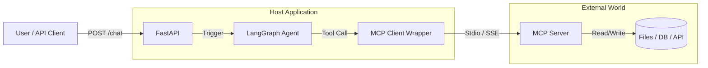

# 🚀 MCP + LangGraph + FastAPI Starter Template

A modular, plug-and-play boilerplate for building AI Agents using **LangGraph** and the **Model Context Protocol (MCP)**.

Designed to solve the "Integration Hell" problem by using MCP as a universal connector for tools (FileSystem, GitHub, Databases, etc.).

---

## 🏗️ Architecture

The application separates the **AI Logic** (Host) from the **Tool Execution** (Server) using MCP.



## 🌟 Features

* **Universal Connectivity:** Connect to any MCP-compliant server (e.g., Google Drive, Slack, Postgres) just by changing `config.py`.
* **Dynamic Tool Discovery:** The Agent automatically "learns" available tools and their arguments from the connected server.
* **LangGraph Brain:** Uses stateful graphs (not just chains) for robust reasoning loops.
* **Production Ready:** Includes Health Checks, Executive Dashboards, and API documentation.
* **Windows Compatible:** Configured to handle `npx.cmd` and `npx` execution.

---

## 🛠️ Installation & Setup

### 1. Prerequisites

* Python 3.10+
* Node.js & npm (Required to run the default MCP Filesystem server)

### 2. Clone and Install

```bash
# Clone the repository
git clone <your-repo-url>
cd mcp-fastapi-template

# Create Virtual Environment
python -m venv venv
./venv/Scripts/Activate  # Windows
# source venv/bin/activate  # Mac/Linux

# Install Python Dependencies
pip install -r requirements.txt

```

### 3. Environment Configuration

Create a file named `.env` in the root directory and add your OpenAI API Key:

```env
OPENAI_API_KEY=sk-proj-YOUR_OPENAI_KEY_HERE

```

### 4. MCP Server Configuration

The project is pre-configured to use the **Local Filesystem Server**.
Check `app/core/config.py`:

```python
# Windows Users: Ensure command is "npx.cmd"
# Mac/Linux Users: Use "npx"
MCP_SERVER_COMMAND = "npx.cmd"
MCP_SERVER_ARGS = ["-y", "@modelcontextprotocol/server-filesystem", "./"]

```

---

## 🚀 Running the Application

Start the FastAPI server using Uvicorn:

```bash
uvicorn app.main:app --reload

```

* **API URL:** `http://127.0.0.1:8000`
* **Swagger Docs:** `http://127.0.0.1:8000/docs`

---

## 🔌 API Endpoints

| Method | Endpoint | Description |
| --- | --- | --- |
| **GET** | `/dashboard` | **Executive Dashboard.** View system uptime, active AI model, and list of auto-discovered tools. |
| **POST** | `/chat` | **Main Agent Interface.** Sends a query to the LangGraph agent. |
| **GET** | `/mcp/tools` | **Inspector.** Returns raw JSON schema of all tools currently connected via MCP. |
| **GET** | `/health` | **Health Check.** Returns 200 OK if service is up. |

---

## 🧩 How to Extend

### Switching to a GitHub Agent

To change this from a FileSystem agent to a GitHub agent, you do **not** need to change the code. Just update `app/core/config.py`:

```python
# Switch to GitHub MCP Server
MCP_SERVER_ARGS = ["-y", "@modelcontextprotocol/server-github"]
# (You will need to set GITHUB_PERSONAL_ACCESS_TOKEN in env)

```

The Agent will automatically lose `read_file` capabilities and gain `create_issue`, `get_pr`, etc.

---

## ⚠️ Troubleshooting

**Error: `[WinError 193] %1 is not a valid Win32 application**`

* **Fix:** You are running on Windows but `config.py` is set to `npx`. Change `MCP_SERVER_COMMAND` to `"npx.cmd"`.

**Error: `Recursion limit reached**`

* **Fix:** The AI is trying to use a tool incorrectly. Ensure `app/mcp/tools.py` is correctly parsing the `inputSchema` to enforce required arguments.

---

**Built for Evren AI**
